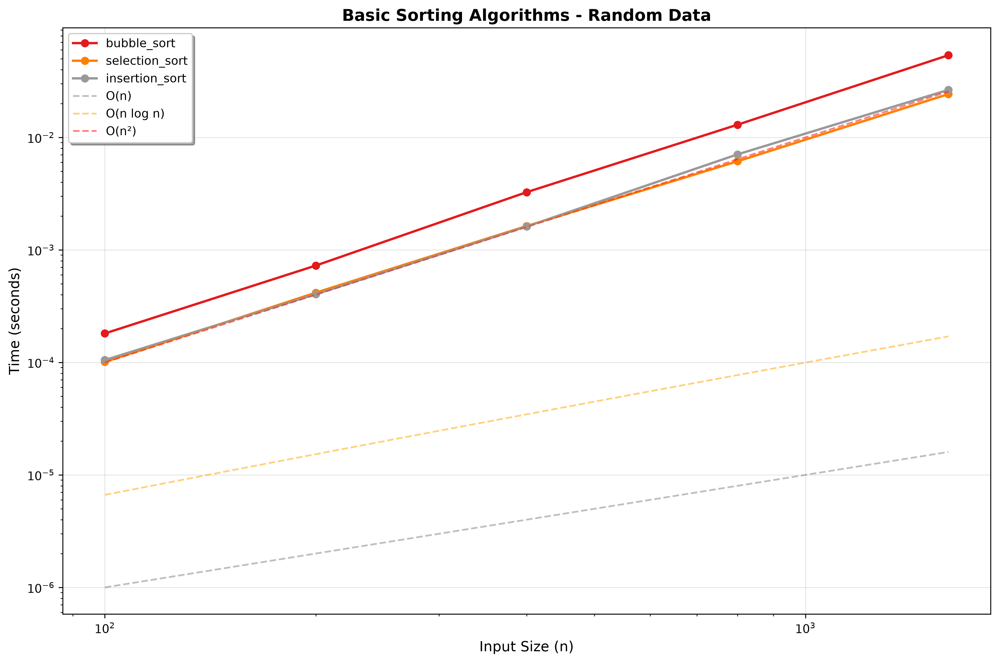
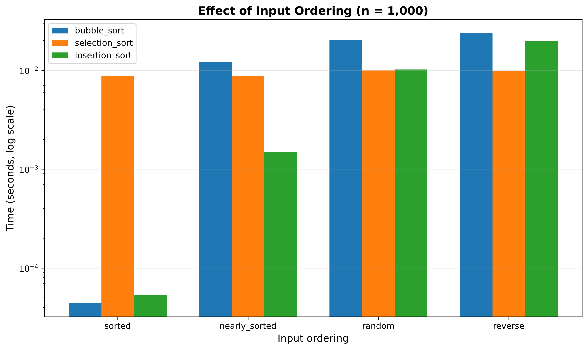

# Performance Analysis: Basic Sorting Algorithms

**Author:** Will Swinson
**Course:** Advanced Algorithms
**Assignment:** Environment Setup & Basic Sorting Algorithms

## 1. Methodology

All measurements were produced by the `AlgorithmBenchmark` framework
(`src/utils/benchmark.py`) via the runner script
`benchmarks/run_sorting_benchmarks.py`:

- **Timer:** `time.perf_counter()` (highest-resolution clock available)
- **Warmup:** 2 untimed runs before measurement, so interpreter caching and
  memory allocation don't pollute the first sample
- **Sampling:** 5 timed runs per configuration; the report uses the mean,
  with standard deviation as the error estimate
- **Isolation:** every run receives a fresh copy of the input, so no run
  benefits from a previous run's sorting
- **Correctness gate:** the framework verifies each algorithm's output is
  sorted and is a permutation of the input before accepting a timing
- **Reproducibility:** the data-type comparison uses a fixed seed (42)
- **Machine:** Apple Silicon Mac, Python 3.13.5 (project `.venv`)

Two experiments were run:

1. **Scaling:** all three algorithms on *random* data at doubling sizes
   n = 100, 200, 400, 800, 1600
2. **Input ordering:** all three algorithms at fixed n = 1000 on
   `sorted`, `nearly_sorted`, `random`, and `reverse` data

## 2. Results

### 2.1 Scaling on random data

Mean time in seconds (± std dev over 5 runs):

| n | bubble_sort | selection_sort | insertion_sort |
|------:|------------:|---------------:|---------------:|
| 100 | 0.000198 | 0.000117 | 0.000115 |
| 200 | 0.000792 | 0.000441 | 0.000424 |
| 400 | 0.003249 | 0.001731 | 0.001745 |
| 800 | 0.012554 | 0.006026 | 0.006419 |
| 1600 | 0.054114 | 0.023567 | 0.027209 |

Every doubling of n multiplies each algorithm's time by roughly **4×**
(e.g. bubble sort: 0.000792 → 0.003249 → 0.012554), the signature of
quadratic growth. The framework's curve-fitting agrees: for all three
algorithms the best fit is **O(n²) with R² = 1.000**, and the doubling
ratios independently confirm quadratic behavior.

Raw data: [`benchmarks/results/sorting_benchmarks.csv`](../benchmarks/results/sorting_benchmarks.csv)

### 2.2 Effect of input ordering (n = 1000)

Mean time in seconds:

| Ordering | bubble_sort | selection_sort | insertion_sort |
|---------------|------------:|---------------:|---------------:|
| sorted | **0.000025** | 0.008567 | 0.000050 |
| nearly_sorted | 0.011762 | 0.008435 | **0.001430** |
| random | 0.019905 | 0.009361 | 0.009458 |
| reverse | 0.022766 | **0.010130** | 0.019472 |

## 3. Analysis and Conclusions

**All three algorithms are quadratic on average — but the constant factors
differ.** On random data, bubble sort is consistently ~2× slower than the
other two (0.0541s vs 0.0236s/0.0272s at n = 1600). The reason is write
volume: bubble sort performs a swap (three assignments) for every inversion
it encounters, while selection sort makes at most n − 1 swaps and insertion
sort uses single-assignment shifts rather than full swaps.

**Bubble sort's early-exit optimization works exactly as theory predicts.**
On already-sorted input it finishes in 25 µs — one O(n) verification pass and
out. That is ~340× faster than selection sort on the *same input*. Without
the `swapped` flag it would have taken ~20 ms like its random case. However,
the optimization is fragile: on *nearly*-sorted data (just 5% of elements
displaced) bubble sort already takes 11.8 ms, because a single element that
needs to move left ("a turtle") can only move one position per pass.

**Insertion sort is the practical winner of the three.** It matches the best
performance on random data, is O(n) on sorted data (50 µs), and — unlike
bubble sort — degrades gracefully: on nearly-sorted data it takes only
1.43 ms, ~6× faster than either competitor. Its cost is proportional to the
number of inversions in the input, and nearly-sorted data has few. This is
why real-world hybrid sorts (e.g. Timsort, used by Python's built-in
`sorted()`) use insertion sort for small or nearly-ordered runs.

**Selection sort is indifferent to input order.** Its times span only
8.4–10.1 ms across all four orderings — the flattest profile of the three —
because it always scans the entire unsorted suffix regardless of how the
data is arranged. That makes it the *slowest* on friendly input (343× slower
than bubble sort on sorted data) but the *fastest* on reverse-sorted input
(10.1 ms vs insertion's 19.5 ms and bubble's 22.8 ms), where its
minimal-swap strategy pays off.

**Takeaways:**

1. Empirical measurement matched theoretical complexity exactly
   (R² = 1.000 for O(n²) on all three) — the laboratory works.
2. Big-O alone doesn't decide which algorithm to use: three "equally"
   O(n²) algorithms differ by up to 340× depending on input ordering.
3. If forced to choose one basic sort, choose insertion sort: best or
   near-best in every scenario except reverse-ordered input.
4. Adaptivity (exploiting existing order) is a more valuable property in
   practice than minimizing any single operation type.
